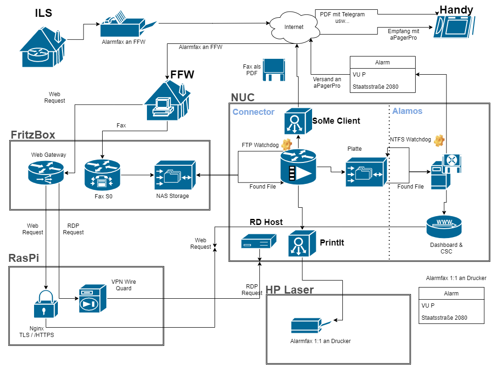

# Alamos connector

This application is used to connect the Alamos [FE2](https://www.alamos-gmbh.com/service/fe2/) alarming system with an FTP drive on a [Fritz! router](https://avm.de/produkte/fritzbox/) the [print-it](https://github.com/huysentruitw/print-it) service to get the original fax document to paper and if required a telegram client.

## Flow and network chart


* The initial trigger is the fax sent by the ils to the previously configured number.
* Router will take it and the place it into the nas storage
* Connector checks periodically for new files by pdf request
* Found files will be processed
  * Stored in local folder for alamos watchdog
  * Sent to print it service by rest request (optional)
  * Converted to telegram message and set to bot (optional)

## Components

* Router as gateway, configure with this [tutorial](http://docu.alamos-gmbh.com/display/documentation/Alarmfax+von+FritzBox+auswerten)
* Nuc PC with Windows OS to host the watchdog (this service) the print-it service and the FE2 Software
* RasPi to serve as gateway for
  * VPN for RDP connections
  * HTTPS server with certbot to secure the csc gui of FE2

## Certbot on raspi

To install certbot follow this [instructions](https://varhowto.com/how-to-enable-https-for-nginx-websites-on-raspbian-raspberry-pi-certbot-python-certbot-nginx-automatic-raspbian/). A Sample configuration can be found [here](./samples/vhost.conf) and [here](./samples/vhost-ssl.conf)


## Wire guard on raspi with pivpn

```bash
# install the vpn server
curl -L https://install.pivpn.io | bash

# create a profile
pivpn add

# route all traffic trough but allow local
iptables -A POSTROUTING -o eth0 -j MASQUERADE -t nat
```
